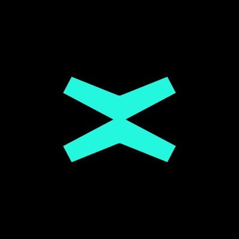

# NearX dojo MultiverX

Distributed blockchain network for next-gen applications.



Dojo [MultiversX](https://multiversx.com/)

[Docs](https://docs.multiversx.com/)

<details>
<summary>Setup</summary>

[Devnet](https://devnet-wallet.multiversx.com/dashboard)

[trx](https://devnet-explorer.multiversx.com/transactions/093aa9c7f771636c0a6d137a8e55258e19a5fddd9ff473f68b9d09b64763f3fc)

```
cargo install multiversx-sc-meta


```

</details>

<details>
<summary>Week 1 - Introduction to Smart Contracts and Rust</summary>

Create a CRUD to manage records.

</details>

<details>
<summary>Week 2 - AI and Typescript</summary>

Create a chatbot using ChatGPT.

</details>
